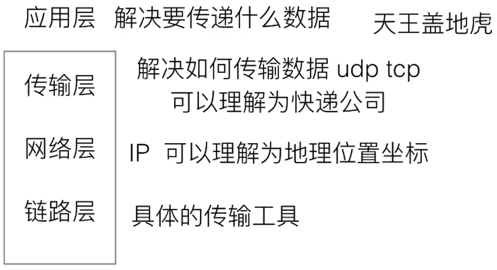
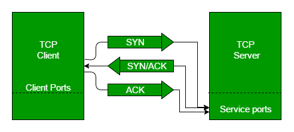
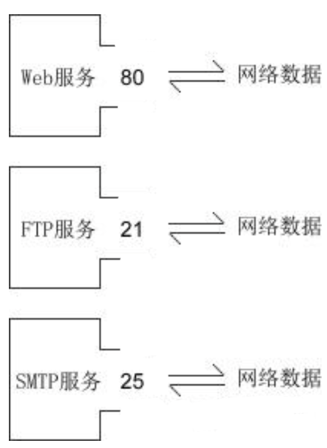

# 开发文档

开发文档中记录了整个项目的实现流程。

## OSI模型简介

OSI模型从下到上分为七个层次，每个层次都有其特定的功能和协议：

### ‌应用层（Application Layer）‌

为用户提供网络应用服务，包括文件传输、电子邮件、网页浏览等。主要协议有HTTP、SMTP、FTP和SSH等。

### ‌表示层（Presentation Layer）‌

负责数据的格式转换、加密和解密，确保应用程序能够正确地解释数据。主要功能包括数据压缩、加密解密和数据格式转换等。

### ‌会话层（Session Layer）‌

管理会话的建立、维护和结束，处理会话层面的错误和同步问题。

### ‌传输层（Transport Layer）‌

提供端到端的数据传输服务，确保数据的可靠性、流量控制和错误检测。主要协议有TCP和UDP。

### ‌网络层（Network Layer）‌

负责在不同的网络之间传输数据，路由数据包并确保它们能够到达目标设备。主要设备包括路由器和三层交换机等，主要协议有IP协议。

### ‌数据链路层（Data Link Layer）‌

将原始比特流分割成帧并添加地址信息，以便在直接连接的设备之间传输数据。主要设备有交换机、网卡和网桥等。

### ‌物理层（Physical Layer）‌

负责在物理传输介质上传输原始比特流，确保数据能够以适当的方式传输到连接的设备之间。主要设备包括集线器、中继器和网线等。



## Socket简介

Socket（套接字）是一种用于实现网络通信的编程接口（API），它它提供了一种可移植、可扩展、易于使用的接口，使得应用程序能够在不同的操作系统和计算机之间进行通信。

### Socket解决的问题

Socket通信主要是为了解决计算机网络中的进程间通信问题。在网络编程中，有两个进程需要进行通信才能完成特定的任务，这两个进程可能运行在不同的计算机上，也可能运行在同一台计算机上的不同进程中。Socket提供了一种标准化的接口，使得这些进程能够在网络中进行数据交换和通信。具体来说，Socket通信可以解决以下几个方面的问题：

#### 进程间通信

在同一台计算机上，不同的进程之间需要进行通信，Socket提供了一种标准化的接口，使得进程之间可以通过网络进行通信。

#### 跨平台通信

不同的计算机、操作系统和编程语言之间需要进行通信，Socket提供了一种可移植的接口，使得应用程序可以在不同的平台上运行并进行通信。

#### 网络通信安全性

网络通信中存在着信息泄露、数据篡改、拒绝服务攻击等安全问题，Socket可以通过加密、身份认证、防火墙等方式提高通信的安全性。

#### 通信协议

Socket提供了一种灵活的通信协议，可以根据需要选择不同的协议来满足特定的通信需求，如TCP、UDP等协议。

### Socket的组成及关键点

Socket 的原意是“插座”，在计算机通信领域，socket 被翻译为“套接字”，它是计算机之间进行通信的一种约定或一种方式。Socket本质上是一个抽象层，它是一组用于网络通信的API，包括了一系列的函数和数据结构，它提供了一种标准的网络编程接口，使得应用程序可以在网络中进行数据传输。Socket本身并不是一个具体的实现，而是一个抽象的概念。不同的操作系统和编程语言可以通过不同的方式来实现Socket API。

通过 Socket 这种约定，一台计算机可以接收其他计算机的数据，也可以向其他计算机发送数据。socket()函数返回一个整型的Socket描述符，随后的连接建立、数据传输等操作都是通过该Socket实现的。

Socket可以类比成电话线路或电线路，就像电话线路或电线路提供了一条可靠的通信通道，使得两个地点之间可以进行语音或数据通信一样，Socket也提供了一条可靠的通信通道，使得两个计算机之间可以进行数据交换和通信。就像我们在打电话或发送信息时需要先建立连接、传输数据，然后再断开连接一样，Socket也需要先建立连接、传输数据，最后再关闭连接。而且就像电话线路或电线路可以支持不同的通信协议和数据类型一样，Socket也可以支持不同的网络协议和数据格式。

在网络编程中，Socket通常被用于实现以下几种类型的网络通信：

1. **流式Socket（TCP套接字）**

   是一种可靠的、双向的通信数据流，数据可以准确无误地到达另一台计算机，如果损坏或丢失，可以重新发送。

   基于TCP协议，提供面向连接的可靠通信方式，适用于传输大量数据或要求数据完整性和可靠性的应用程序。

2. **数据报式Socket（UDP套接字）**

   计算机只管传输数据，不作数据校验，如果数据在传输中损坏，或者没有到达另一台计算机，是没有办法补救的。也就是说，数据错了就错了，无法重传。因为数据报套接字所做的校验工作少，所以在传输效率方面比流格式套接字要高。

   基于UDP协议，提供无连接的不可靠通信方式，适用于数据量小、响应快、实时性要求高的应用程序。

3. **原始Socket（Raw Socket）**

   提供对网络协议的底层访问，适用于实现特定的网络协议和功能。

### Socket通信实现的步骤

Socket通信实现的步骤一般如下：

####  基于TCP的实现

1. **创建Socket**

   使用socket()函数创建一个Socket，指定通信协议、地址族和Socket类型等参数。创建Socket成功后，系统会为该Socket分配一个唯一的Socket描述符（Socket file descriptor）。

2. **绑定Socket**

   使用bind()函数将Socket与本地地址和端口绑定，以便客户端可以连接到该Socket。在绑定Socket时，需要指定通信协议、地址族和本地地址等参数。

3. **监听Socket**

   使用listen()函数将Socket设置为监听状态，以等待客户端的连接请求。在监听Socket时，需要指定最大连接数等参数。

4. **接受连接**

   使用accept()函数接受客户端的连接请求，并创建一个新的Socket用于与客户端进行通信。在接受连接时，需要指定监听Socket和客户端地址等参数。

5. **发送和接收数据**

   使用send()函数向对端发送数据，使用recv()函数接收对端发送的数据。在发送和接收数据时，需要指定通信Socket、发送/接收缓冲区和数据长度等参数。

6. **关闭Socket**

   使用close()函数关闭Socket，释放系统资源。 以上是基于TCP协议的Socket通信实现步骤。

#### 基于UDP的实现

如果是基于UDP协议的Socket通信，则无需建立连接，只需要在发送和接收数据时指定对端地址和端口即可。

### Socket编程流程

#### 针对TCP的Socket编程

1. 服务端和客户端初始化 `socket`，得到文件描述符；

2. 服务端调用 `bind`，将 socket 绑定在指定的 IP 地址和端口;

3. 服务端调用 `listen`，进行监听；

4. 服务端调用 `accept`，等待客户端连接；

5. 客户端调用 `connect`，向服务端的地址和端口发起连接请求；

6. 服务端 accept 返回用于传输的 socket 的文件描述符；

7. 客户端调用 write 写入数据；服务端调用 read 读取数据；

8. 客户端断开连接时，会调用 close，那么服务端 read 读取数据的时候，就会读取到了 EOF，待处理完数据后，服务端调用 close，表示连接关闭。

这里需要注意的是，服务端调用 `accept` 时，连接成功了会返回一个已完成连接的 socket，后续用来传输数据。

所以，监听的 socket 和真正用来传送数据的 socket，是「两个」 socket，一个叫作**监听 socket**，一个叫作**已完成连接 socket**。

成功连接建立之后，双方开始通过 read 和 write 函数来读写数据，就像往一个文件流里面写东西一样。


### Socket的底层原理

Socket 通信主要涉及到传输层（TCP/UDP）和应用层。

#### TCP/IP 协议族：

Socket 通信主要依赖于 TCP/IP 协议族。TCP/IP 协议族包括一组互相关联的网络协议，例如 IP（Internet Protocol，网络层协议）、TCP（Transmission Control Protocol，传输层协议）、UDP（User Datagram Protocol，传输层协议）等。Socket 通信使用 TCP 或 UDP 协议进行数据传输。

#### TCP连接建立时的三次握手过程和四次挥手过程

1. **三次握手建立连接**

   第一次握手，客户端向服务器发送SYN报文，包含客户端的初始序列号（如SEQ=x）和窗口大小等信息，表明客户端请求建立连接。

   第二次握手，服务器收到客户端的SYN报文后，返回SYN-ACK报文，其中包含服务器的初始序列号（如SEQ=y）、确认号（ACK=x+1）和服务器的窗口大小，确认客户端的连接请求并告知客户端自己的初始信息。

   第三次握手，客户端收到服务器的SYN-ACK报文后，发送ACK报文，确认号为ACK=y+1，序号为x+1，至此连接建立成功。

   

   三次握手的主要意义在于初始化通信双方的序列号、确认号和窗口大小等信息，确保双方能够正确识别和处理后续的数据传输。它为可靠的数据传输建立了必要的通信环境，使得双方能够在一个有序、可控的状态下开始数据交换，同时也防止了已失效的连接请求对网络资源的占用。

2. **四次挥手拆除连接**

第一次挥手，客户端发送FIN报文，表明客户端不再发送数据，请求关闭连接。

第二次挥手，服务器收到FIN报文后，发送ACK报文确认收到客户端的关闭请求。此时，服务器可能仍有数据要发送给客户端，因此连接处于半关闭状态。

第三次挥手，当服务器完成数据发送后，发送FIN报文给客户端，请求关闭连接。

第四次挥手，客户端收到FIN报文后，发送ACK报文确认收到服务器的关闭请求，经过一段时间的等待（确保服务器收到ACK报文）后，客户端关闭连接，服务器收到ACK报文后也关闭连接，至此连接完全拆除。


四次挥手过程确保了通信双方能够正确释放连接所占用的资源，包括内存、端口号等。在网络通信中，资源的正确管理和释放对于系统的稳定运行至关重要，四次挥手机制能够有效避免资源泄漏和错误使用，保证网络通信的可靠性和稳定性。

#### 网络通信三要素

1. **IP地址**

   IP地址是 Internet Protocol Address 的缩写，译为“网际协议地址”。IP 地址是用于标识网络设备的数字地址。在 IPv4（Internet Protocol version 4）中，IP 地址由 4 个字节组成，例如 192.168.1.1。在 IPv6（Internet Protocol version 6）中，IP 地址由 8 组 16 位十六进制数组成，例如 2001:0db8:85a3:0000:0000:8a2e:0370:7334。在因特网上进行通信时，必须要知道对方的 IP 地址。实际上数据包中已经附带了 IP 地址，把数据包发送给路由器以后，路由器会根据 IP 地址找到对方的位置，完成一次数据的传递。

2. **MAC地址**

   MAC 地址是 Media Access Control Address 的缩写，直译为“媒体访问控制地址”，也称为局域网地址（LAN Address），以太网地址（Ethernet Address）或物理地址（Physical Address）。

   现实的情况是，一个局域网往往才能拥有一个独立的 IP；换句话说，IP 地址只能定位到一个局域网，无法定位到具体的一台计算机。

   因此数据包中除了会附带对方的 IP 地址，还会附带对方的 MAC 地址，当数据包达到局域网以后，路由器/交换机会根据数据包中的 MAC 地址找到对应的计算机，然后把数据包转交给它，这样就完成了数据的传递。

3. **端口号**

   端口号是一个用于标识网络服务或应用程序的数字。

   有了 IP 地址和 MAC 地址，虽然可以找到目标计算机，但仍然不能进行通信。一台计算机可以同时提供多种网络服务，例如 Web 服务（网站）、FTP 服务（文件传输服务）、SMTP 服务（邮箱服务）等，仅有 IP 地址和 MAC 地址，计算机虽然可以正确接收到数据包，但是却不知道要将数据包交给哪个网络程序来处理，所以通信失败。

   为了区分不同的网络程序，计算机会为每个网络程序分配一个独一无二的端口号（Port Number）。端口号范围从 0 到 65535，其中 0 到 1023 通常保留给系统或者众所周知的服务（如 HTTP、FTP 等）。

   端口（Port）是一个虚拟的、逻辑上的概念。可以将端口理解为一道门，数据通过这道门流入流出，每道门有不同的编号，就是端口号。

   

### Socket的优劣

#### Socket通信的优势

1. **网络通信协议的灵活性**

   Socket可以支持各种网络通信协议，如TCP、UDP、HTTP等，具有很强的通用性和灵活性，可以满足不同的网络应用需求。

2. **数据传输的可靠性**

   Socket提供了面向连接的通信方式，可以保证数据传输的可靠性和完整性，避免数据丢失、重复和损坏等问题。

3. **系统资源的高效利用**

   Socket可以使用多线程和多进程技术，实现并发处理多个客户端的请求，充分利用系统资源，提高通信效率和吞吐量。

4. **程序设计的灵活性**

   Socket可以使用各种编程语言和工具进行开发，程序设计灵活性强，可以根据具体需求进行定制化开发。

#### Socket通信的劣势

1. **网络通信的安全性问题**

   Socket通信存在网络安全方面的问题，如数据窃听、篡改、伪造等，需要采取一些安全措施来保障通信安全。

2. **网络环境的不稳定性**

   Socket通信受到网络环境的影响，如网络延迟、丢包、拥塞等，会影响通信效率和可靠性。

3. **系统资源占用较高**

   Socket通信需要占用一定的系统资源，如内存、CPU等，如果同时处理大量的客户端请求，可能会占用大量的系统资源，导致系统负载过高。

## 多线程服务器的构建

### 服务器类Server的初始化

#### 定义端口号属性

在Server类中，定义一个`int`类型的变量`port`，用于存储服务器要监听的端口号，这个端口号将在后续创建服务器套接字`ServerSocket`时使用。

#### 构造函数设置端口号

Server类提供了一个构造函数`public Server(int port)`，通过传入的参数来初始化`this.port`，也就是确定服务器具体监听的端口。

### 服务器启动（build 方法）流程

#### 启动提示信息输出

在build方法中，首先会输出"This is Server"提示信息，用于表明服务器相关代码正在执行，方便在控制台查看程序运行阶段。

#### 创建服务器套接字（ServerSocket）

声明一个`ServerSocket`类型的变量`serverSocket`并初始化为`null`，将其定义在`try`代码块外部，以便后续能在finally块中进行关闭操作。

在try代码块内，通过`new ServerSocket(this.port)`创建一个绑定到指定端口的服务器套接字。如果端口被其他程序占用或者出现其他创建套接字相关的异常情况，就会抛出`IOException`，并在`catch`块中打印堆栈信息进行异常处理。

成功创建服务器套接字后，会输出"Waiting for request"的提示信息，表示服务器已经准备好，正在等待客户端的连接请求。

#### 监听客户端请求并处理

进入一个无限`while`循环，通过`serverSocket.accept()`方法来监听客户端的连接请求。每当有一个客户端发起连接时，这个方法就会返回一个新的套接字`Socket`对象，代表与该客户端建立的连接，同时会输出"New client connected\n"的提示信息，表明有新客户端连接成功。

对于每个新连接的客户端，会创建一个新的`ClientHandler`线程对象`new ClientHandler(clientSocket).start()`，并启动该线程。这个`ClientHandler`线程的任务就是专门处理对应客户端发送过来的数据，实现了服务器可以同时处理多个客户端请求的多线程机制。

### 客户端请求处理类ClientHandler的工作流程

#### 初始化客户端套接字属性

`ClientHandler`类有一个构造函数`public ClientHandler(Socket clientSocket)`，通过传入的参数来初始化类中的`this.clientSocket`属性，使得每个`ClientHandler`线程对象都关联到对应的客户端套接字。

#### 线程运行（run 方法）流程

在`run`方法中，首先通过`clientSocket.getInputStream()`获取与客户端连接对应的输入流，用于读取客户端发送过来的数据。然后将这个输入流包装到`BufferedReader`中，方便按行读取数据。

进入一个`while`循环，通过`br.readLine()`不断从输入流中读取客户端发送的字符串数据，只要读取到的数据不为`null`，就会输出`"Client: "`加上读取到的数据内容这样的信息，用于在服务器端控制台展示客户端发送的消息内容。

在`finally`块中，会进行资源关闭操作。先判断`br`（`BufferedReader`）是否为`null`，如果不为`null`，则关闭它，避免资源泄露；接着判断`clientSocket`是否为`null`，如果不为`null`，同样关闭它，断开与客户端的连接并释放相关的网络资源。

## 客户端的构建

### 客户端类（Client）的初始化

#### 定义 IP 地址和端口号属性

在`Client`类中，首先定义了两个变量，`String`类型的`IP`用于存储要连接的服务器的 IP 地址，`int`类型的`port`用于存储服务器的端口号，这两个属性将用于后续创建客户端套接字（Socket）以及连接服务器。

#### 构造函数设置 IP 和端口号

`Client`类提供了一个构造函数`public Client(String IP, int port)`，通过传入的参数分别对`this.port`和`this.IP`进行初始化，从而确定客户端要连接的具体服务器地址及端口。

###  客户端启动（build 方法）流程

#### 资源初始化与异常处理准备

在`build`方法中，先声明了`Socket`类型的变量`clientSocket`和`PrintWriter`类型的变量`pw`，并都初始化为`null`。将它们定义在`try`代码块外部，是为了后续能在`finally`块中方便地进行资源关闭操作，确保资源能被正确释放，避免资源泄露。

由于创建客户端套接字（`Socket`）的构造函数可能会抛出异常，所以使用`try-catch`语句块来包裹相关代码，用于捕获并处理可能出现的异常情况。

#### 创建客户端套接字（Socket）并连接服务器

在`try`代码块内，通过`new Socket(this.IP, this.port)`创建一个客户端套接字，传入之前在构造函数中初始化好的服务器 IP 地址（`this.IP`）和端口号（`this.port`），尝试与指定的服务器建立网络连接。如果在创建套接字或者连接服务器过程中出现问题（比如服务器地址不可达、端口未开放等情况），就会抛出异常，被`catch`块捕获，然后在`catch`块中通过`e.printStackTrace()`打印异常堆栈信息来展示具体的异常情况。

#### 向服务器发送数据（通过输出流操作）

首先，获取客户端套接字的输出流，通过`pw = new PrintWriter(clientSocket.getOutputStream())`创建一个`PrintWriter`对象，它基于客户端套接字的输出流，方便后续向服务器端写入数据。

接着，使用`pw.write(message)`将传入`build`方法的`message`字符串写入到输出流中，此时数据实际上是暂存在缓冲区里，对于大多数输出流来说，写入的数据会先放在缓冲区内，不会立即发送出去。

为了确保缓冲区中的数据真正发送到服务器端，需要执行`pw.flush()`方法，它会强制将缓冲区内的数据输出到服务器端。

## Web服务器的测试

运行服务器程序，然后我们进入浏览器，在上方输入网址的地方输入

```
127.0.0.1:10000/hello
```

或

```
localhost:10000/hello
```

此时在服务器端会得到来自浏览器的请求，具体内容如下：

```
GET /hello HTTP/1.1
Host: 127.0.0.1:10000
Connection: keep-alive
sec-ch-ua: "Microsoft Edge";v="131", "Chromium";v="131", "Not_A Brand";v="24"
sec-ch-ua-mobile: ?0
sec-ch-ua-platform: "Windows"
Upgrade-Insecure-Requests: 1
User-Agent: Mozilla/5.0 (Windows NT 10.0; Win64; x64) AppleWebKit/537.36 (KHTML, like Gecko) Chrome/131.0.0.0 Safari/537.36 Edg/131.0.0.0
Accept: text/html,application/xhtml+xml,application/xml;q=0.9,image/avif,image/webp,image/apng,*/*;q=0.8,application/signed-exchange;v=b3;q=0.7
Sec-Fetch-Site: none
Sec-Fetch-Mode: navigate
Sec-Fetch-User: ?1
Sec-Fetch-Dest: document
Accept-Encoding: gzip, deflate, br, zstd
Accept-Language: zh-CN,zh;q=0.9,en;q=0.8,en-GB;q=0.7,en-US;q=0.6
```

其分别表示的含义如下：

### 请求行

1. `GET /hello HTTP/1.1`

   请求，由三部分组成：

   - **请求方法**

     GET 是 HTTP 协议中最常用的请求方法之一。它用于从指定的资源（服务器）获取数据。这种请求是幂等的，意味着多次相同的 GET 请求应该返回相同的结果，只要服务器上的数据没有变化。

   - **请求目标**

     - **路径表示**：

       它是一个统一资源标识符的路径部分。这个路径是相对于服务器根目录的，用于指定客户端想要访问的资源位置。服务器会根据这个路径来定位和返回相应的资源。不同的服务器应用程序会对这个路径有不同的处理方式。

     - **与服务器资源的关联**：

       对于 Web 服务器，这个路径可能指向一个 HTML 文件、一个脚本文件或者是一个由服务器端框架（处理的服务端点。在这个例子中，“/hello” 是一个自定义的路径，服务器可能会根据这个路径返回一个包含 “hello” 相关内容的网页或者数据响应。

   - **协议版本**

     HTTP/1.1 是 HTTP 协议的一个版本。与 HTTP/1.0 相比，HTTP/1.1 有很多改进，比如它支持持久连接，使得一个 TCP 连接可以用于多个 HTTP 请求 / 响应周期，减少了建立和关闭连接的开销，提高了网络传输效率。

     客户端发送这个协议版本信息是为了告知服务器它所支持的协议版本。服务器会根据这个信息来选择合适的通信方式和规则来处理请求。如果服务器不支持 HTTP/1.1，可能会返回一个错误或者尝试使用其他兼容的协议版本来进行通信。在这个请求中，客户端希望按照 HTTP/1.1 的规则来进行数据交互。

### 请求头部

1. `Host: 127.0.0.1:10000`

   指定了请求要发送到的服务器的主机名和端口号。“127.0.0.1” 是本地回环地址，表示请求发送到本地计算机，“10000” 是端口号，用于区分同一台计算机上的不同网络服务。服务器会根据这个信息来确定哪个服务（如果有多个在运行）应该接收这个请求。

2. `Connection: keep - alive`

   表示客户端希望与服务器保持持久连接。在 HTTP/1.1 中，默认是持久连接，这样在一次 TCP 连接上可以发送多个请求 - 响应，减少了频繁建立和断开连接的开销，提高了网络传输效率。

3. `sec - ch - ua: "Microsoft Edge";v="131", "Chromium";v="131", "Not_A Brand";v="24"`

   是一个和浏览器用户代理（User - Agent）相关的安全头信息。它提供了关于浏览器品牌和版本的信息，用于安全策略和内容协商等目的。这里显示了与 Microsoft Edge、Chromium 相关的版本信息，用于服务器识别客户端浏览器的相关特性。

4. `sec - ch - ua - mobile:?0`

   用于告知服务器客户端是否是移动设备。“?0” 表示不是移动设备，这有助于服务器根据设备类型提供合适的内容，对于移动设备可能提供适合小屏幕的布局等。

5. `sec - ch - ua - platform: "Windows"`

   告诉服务器客户端所在的操作系统平台是 Windows。这对于服务器提供与操作系统兼容的内容或者进行针对性的安全策略等操作很有帮助。

6. `Upgrade - Insecure - Requests: 1`

   表示客户端倾向于将不安全的请求（如 HTTP 请求）升级为安全的请求（如 HTTPS 请求）。这是一种安全增强的机制，鼓励服务器和客户端之间使用更安全的通信方式。

7. `User - Agent: Mozilla/5.0 (Windows NT 10.0; Win64; x64) AppleWebKit/537.36 (KHTML, like Gecko) Chrome/131.0.0.0 Safari/537.36 Edg/131.0.0.0`

   这是一个非常重要的请求头。它向服务器提供了客户端软件（通常是浏览器）的详细信息，包括操作系统版本（Windows NT 10.0）、浏览器引擎（AppleWebKit、KHTML）以及浏览器的品牌和版本（Chrome/131.0.0.0、Edg/131.0.0.0）。服务器可以根据这个信息来调整返回内容的格式、适配浏览器特性或者进行访问统计等操作。

8. `Accept: text/html,application/xhtml+xml,application/xml;q = 0.9,image/avif,image/webp,image/apng,\*/\*;q = 0.8,application/signed - exchange;v = b3;q = 0.7`

   用于告诉服务器客户端能够接受的媒体类型及其优先级。在这里，客户端最希望接收 text/html 类型的内容，其次是 application/xhtml+xml 和 application/xml 等，“q” 值表示优先级权重，值越高优先级越高。这有助于服务器根据客户端的偏好来选择合适的内容格式进行返回。

9. `Sec - Fetch - Site: none`

   与跨域请求相关，它表示这个请求的来源情况。“none” 可能意味着这个请求不是来自于其他域（跨域），可能是用户直接在浏览器地址栏输入网址或者是通过本地的脚本等发起的请求。

10. `Sec - Fetch - Mode: navigate`

    表示请求的模式是导航，通常用于获取一个完整的文档，比如加载一个网页，这和其他可能的请求模式（如 fetch 用于获取资源片段）有所区别。

11. `Sec - Fetch - User:?1`

    这个头信息和用户相关操作有关，“?1” 可能表示请求涉及用户交互或者用户认证等情况，具体含义因应用场景和服务器配置而异。

12. `Sec - Fetch - Dest: document`

    表示请求的目标是获取一个文档，通常是 HTML 文档，这有助于服务器确定返回内容的类型和用途。

13. `Accept - Encoding: gzip, deflate, br, zstd`

    告诉服务器客户端支持的内容编码格式。这意味着服务器可以对返回的内容进行这些编码方式中的一种或多种压缩，以减少网络传输的数据量，提高传输效率。客户端在收到编码后的内容后会进行相应的解码操作。

14. `Accept - Language: zh - CN,zh;q = 0.9,en;q = 0.8,en - GB;q = 0.7,en - US;q = 0.6`

    表示客户端能够接受的语言及其优先级。“zh - CN” 是最优先的语言，表示简体中文，“q” 值表示优先级权重。服务器可以根据这个信息来提供以相应语言显示的内容。